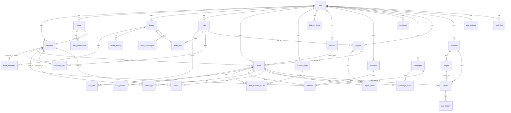

# Database schema — Stage 2

This is the Supabase (Postgres) schema for everything the demo keeps in its
in-memory `db` object. It replaces `db`'s shape with normalized tables, one
`org_id` tenant boundary added throughout (the demo only ever ran as a
single team; a real backend has to host many). No frontend code changed in
this stage — `src/**` is untouched.

Every table has `created_at`/`updated_at` (the latter auto-maintained by a
`set_updated_at()` trigger, see `0001_extensions_and_helpers.sql`) and,
except `orgs` itself, an `org_id` foreign key. Money columns are
`numeric(14,2)`; percentages are `numeric(5,2)`. Primary keys are
`bigint generated by default as identity` — "by default" (not "always") so
`supabase/seed.sql` can insert explicit ids and the sequence gets bumped
past them afterward.

**Out of scope for this stage, by design:**
- **Row Level Security / policies** — Stage 2 is schema + seed only, per the
  stage prompt. Every table is wide open until an RLS stage adds policies
  keyed off `org_id` and `auth.uid() → members.auth_user_id`.
- **`db.invites`** (admin.js `inviteDlg`/`acceptInvite`) — not in this
  stage's table list. It's a tiny one-shot queue (`{id, email, role}`) that
  turns into a real `members` row on acceptance; deferred rather than
  invented, per "don't add tables the stage prompt didn't ask for." Flagging
  the conflict here as instructed: the demo has this feature, the stage
  prompt's table list doesn't mention it.
- **Password hashing columns** (`session.js`'s `pwHash`/`pwSalt`/
  `mustChangePw`/`demoLogin`/`pwSetAt`) — the stage prompt's `members`
  column list has `auth_user_id` instead. In a real Supabase backend,
  credentials live in `auth.users`, not a hand-rolled sha256 hash column;
  `auth_user_id` is the link to that. `must_change_pw` is the one password
  concern the prompt did ask for, so it stays as a plain flag the app can
  still act on post-auth.

## Entity relationship diagram



## Column-by-column mapping

"Demo key" is the exact property name on the in-memory JS object (source
file in parens). Every key on every seeded object is listed — nothing is
"TODO".

### Member (`db.members[]`, `core/session.js` / `data/upgrade.js`)

| Demo key | Column | Notes |
|---|---|---|
| `id` | `members.id` | |
| `name` | `members.first` + `members.last` | Demo only stores `name`; `upgradeDb()` splits it ("first token is first, rest is last") the first time it runs. Schema stores the already-split form. |
| `email` | `members.email` | `unique (org_id, email)` |
| `role` | `members.role_id` | FK → `roles(org_id, id)` |
| `active` | `members.active` | |
| `first` / `last` | `members.first` / `members.last` | (post-`upgradeDb()` shape) |
| `demoLogin` | *(dropped)* | Local-password-only concept; superseded by `auth_user_id`. |
| `mustChangePw` | `members.must_change_pw` | |
| `listIds` | `member_lists` | join table, not a column |
| `createdAt` | `members.created_at` | |
| `lastLogin` | `members.last_login` | |
| `pwHash` / `pwSalt` / `pwSetAt` | *(dropped)* | Superseded by `auth_user_id` → `auth.users` |
| *(new)* | `members.auth_user_id` | Link to Supabase Auth — no demo equivalent |
| *(new)* | `members.deactivated_at` | Stage prompt asked for it; demo only has the `active` boolean, so this is when it most recently flipped to `false` (set by application code, not the demo). |
| *(new)* | `members.created_by` | Stage prompt asked for it; demo doesn't track who created a member. |

### Role (`db.roles[]`, `core/permissions.js` `defaultRoles()`)

| Demo key | Column |
|---|---|
| `id` | `roles.id` (text, scoped by `org_id`) |
| `name` | `roles.name` |
| `description` | `roles.description` |
| `builtIn` | `roles.built_in` |
| `superAdmin` | `roles.super_admin` |
| `perms` (object, 62 boolean keys — `PERMISSIONS` catalog in `core/permissions.js`) | `role_permissions` — one row per `(role_id, permission_key)` |

### Team (`db.teams[]`, `data/upgrade.js`)

| Demo key | Column |
|---|---|
| `id` | `teams.id` |
| `name` | `teams.name` |
| `description` | `teams.description` |
| `color` | `teams.color` |
| `logo` | `teams.logo_url` |
| `managerId` | `teams.manager_id` |
| `memberIds` | `team_members` (join table) |
| `listIds` | `team_lists` (join table) |
| `campaignIds` | `team_campaigns` (join table) |
| `archived` | `teams.archived` |
| `createdAt` | `teams.created_at` |

`db.teamHistory[]` (`data/upgrade.js`: `{userId, teamId, joined, left}`) → `team_history` (`member_id`, `team_id`, `joined`, `"left"`).

### List (`db.lists[]`)

| Demo key | Column |
|---|---|
| `id` | `lists.id` |
| `name` | `lists.name` |
| `archived` | `lists.archived` |
| `createdAt` | `lists.created_at` |

### Lead (`db.leads[]`, `features/leads.js` / `features/activity.js`)

| Demo key | Column | Notes |
|---|---|---|
| `id` | `leads.id` | |
| `first` | `leads.first` | |
| `last` | `leads.last` | |
| `email` | `leads.email` | |
| `addr` | `leads.addr` | |
| `city` | `leads.city` | |
| `state` | `leads.state` | Present in `leadForm()`'s blank-lead default; not filled by seed data. |
| `zip` | `leads.zip` | |
| `assigned` | `leads.assigned_id` | nullable — unassigned imports leave it null |
| `status` | `leads.status_key` | FK → `statuses(org_id, key)` |
| `dnc` / `dnt` / `dncontact` | `leads.dnc` / `leads.dnt` / `leads.dncontact` | |
| `archived` | `leads.archived` | |
| `source` | `leads.source` | `"import"` for seeded/imported leads; the app also writes other free-text values (e.g. a lead created by hand). |
| `importId` | `leads.import_id` | nullable FK → `imports(id)` |
| `createdAt` | `leads.created_at` | |
| `listIds` | `lead_lists` | join table |
| `phones` (`[{n, type}]`) | `lead_phones` | `position` = array index |
| `custom` (sparse object) | `lead_custom_values` | one row per key the lead actually has, matching the demo's sparse object — no row for a field the lead has never had set |
| `notesCount` | *(dropped)* | Dead field — set to `0` by the seed helper `L()` and never read anywhere else in the app; the real count is a live query against `notes`, exactly like every other page already computes it. |

### Custom field (`db.customFields[]`, `core/fields.js`)

| Demo key | Column |
|---|---|
| `id` | `custom_fields.id` |
| `key` | `custom_fields.key` (`unique (org_id, key)`) |
| `label` | `custom_fields.label` |
| `type` | `custom_fields.type` (`CF_TYPES`: text / long_text / number / money / date / yes_no / choice) |
| `choices` | `custom_fields.choices` (jsonb array — only meaningful when `type='choice'`) |
| `hint` | `custom_fields.hint` |
| `inTable` | `custom_fields.in_table` |
| `onCard` | `custom_fields.on_card` |
| `active` | `custom_fields.active` |
| `order` | `custom_fields."order"` |

### Built-in field (`db.settings.builtInFields[]`, `core/fields.js` `defaultBuiltInFields()`)

| Demo key | Column |
|---|---|
| `key` | `built_in_fields.key` (`unique (org_id, key)`) |
| `label` | `built_in_fields.label` |
| `visible` | `built_in_fields.visible` |
| `required` | `built_in_fields.required` |
| `always` | `built_in_fields.always` |

### Status (`db.settings.statuses[]`, `core/statuses.js` `defaultStatuses()`)

| Demo key | Column | Notes |
|---|---|---|
| `key` | `statuses.key` (`unique (org_id, key)`) | |
| `label` | `statuses.label` | |
| `tone` | `statuses.tone` | |
| `active` | `statuses.active` | |
| `locked` | `statuses.locked` | |
| *(implicit array position)* | `statuses."order"` | The demo has no explicit order field — `moveStatus()` reorders the array in place. The stage prompt asked for an `order` column, so it's populated from seed array position (×10, room to insert between). |

### Outcome (`db.outcomes[]`)

| Demo key | Column |
|---|---|
| `id` | `outcomes.id` |
| `name` | `outcomes.name` |
| `conv` | `outcomes.conv` |
| `appt` | `outcomes.appt` |
| `dnc` | `outcomes.dnc` |
| `disabled` | `outcomes.disabled` |

### Activity (`db.activities[]`, `features/activity.js` `logActivity()`)

| Demo key | Column |
|---|---|
| `id` | `activities.id` |
| `leadId` | `activities.lead_id` |
| `type` | `activities.type` (call / text / reply / door_knock) |
| `outcomeId` | `activities.outcome_id` |
| `userId` | `activities.user_id` |
| `at` | `activities.at` |
| `note` | `activities.note` |
| `listId` | `activities.list_id` |
| `campaignId` | `activities.campaign_id` |
| `durationMin` | `activities.duration_min` |
| `phone` | `activities.phone` | (added by `logActivity()`'s call site, not the base object literal — see `saveActivity()`/`markSent()`/`logReply()`) |

### Follow-up (`db.followUps[]`, `features/activity.js`)

| Demo key | Column |
|---|---|
| `id` | `follow_ups.id` |
| `leadId` | `follow_ups.lead_id` |
| `due` | `follow_ups.due` |
| `status` | `follow_ups.status` (pending / done / cancelled) |
| `note` | `follow_ups.note` |
| `assignee` | `follow_ups.assignee_id` |
| `createdAt` | `follow_ups.created_at` |
| `cancelReason` | `follow_ups.cancel_reason` |
| `cancelledBy` | `follow_ups.cancelled_by` |
| `doneAt` | `follow_ups.done_at` |

### Note (`db.notes[]`, `features/activity.js` `addNote()`)

| Demo key | Column |
|---|---|
| `id` | `notes.id` |
| `leadId` | `notes.lead_id` |
| `userId` | `notes.user_id` |
| `at` | `notes.at` |
| `text` | `notes.text` |
| `kind` | `notes.kind` (quick / manager) |

### Template (`db.templates[]`, `views/campaigns.js` `templateForm()`)

| Demo key | Column |
|---|---|
| `id` | `templates.id` |
| `name` | `templates.name` |
| `style` | `templates.style` |
| `body` | `templates.body` |

### Campaign (`db.campaigns[]`, `views/campaigns.js`)

| Demo key | Column |
|---|---|
| `id` | `campaigns.id` |
| `name` | `campaigns.name` |
| `type` | `campaigns.type` |
| `body` | `campaigns.body` |
| `archived` | `campaigns.archived` |
| `createdAt` | `campaigns.created_at` |
| `duplicatedFrom` | `campaigns.duplicated_from` | set by `duplicateCampaign()`, absent on an original campaign |

### Campaign lead (`db.campaignLeads[]`, `features/leads.js` `addLeadsToCampaign()`)

| Demo key | Column |
|---|---|
| `id` | `campaign_leads.id` |
| `campaignId` | `campaign_leads.campaign_id` |
| `leadId` | `campaign_leads.lead_id` |
| `body` | `campaign_leads.body` (nullable — falls back to the campaign's own body, see `cardBody()`) |
| `status` | `campaign_leads.status` (draft / ready / sent / replied) |
| `sentAt` | `campaign_leads.sent_at` |
| `sentBy` | `campaign_leads.sent_by` |
| `repliedAt` | `campaign_leads.replied_at` |

### Import (`db.imports[]`, `views/imports.js` `importRun()`)

| Demo key | Column |
|---|---|
| `id` | `imports.id` |
| `file` | `imports.file` |
| `listId` | `imports.list_id` |
| `rows` | `imports.rows` |
| `imported` | `imports.imported` |
| `dups` | `imports.dups` |
| `status` | `imports.status` (running / completed / undone) |
| `by` | `imports.by_id` |
| `at` | `imports.at` |
| `leadIds` | `import_leads` | join table; the 2 seed imports have `leadIds:[]` (a known, deliberately-preserved demo quirk — the seed imports predate this tracking, which is why the Undo button is hidden for them), so no `import_leads` rows exist for them either. |

### Pipeline (`db.pipelines[]`, `features/crm.js` `newPipeline()`)

| Demo key | Column |
|---|---|
| `id` | `pipelines.id` |
| `name` | `pipelines.name` |
| `kind` | `pipelines.kind` |
| `stages` | `stages` | one-to-many, not embedded |
| `archived` | `pipelines.archived` |
| `createdAt` | `pipelines.created_at` |

### Stage (`db.pipelines[].stages[]`, `features/crm.js` `defaultStages()`)

| Demo key | Column |
|---|---|
| `id` | `stages.id` |
| `name` | `stages.name` |
| `prob` | `stages.prob` |
| `kind` | `stages.kind` (active / closed / lost) |
| `color` | `stages.color` |
| `archived` | `stages.archived` |
| *(implicit array position)* | `stages."position"` | Same situation as `statuses."order"` — `moveStage()` reorders the array; the prompt's `position` column is populated from that array index. |

### Deal (`db.deals[]`, `features/crm.js` `addToCrm()`)

| Demo key | Column |
|---|---|
| `id` | `deals.id` |
| `leadId` | `deals.lead_id` |
| `pipelineId` | `deals.pipeline_id` |
| `stageId` | `deals.stage_id` |
| `assigned` | `deals.assigned_id` |
| `temperature` | `deals.temperature` (hot / warm / cold) |
| `price` | `deals.price` |
| `commPct` | `deals.comm_pct` |
| `referralPct` | `deals.referral_pct` |
| `teamSplitPct` | `deals.team_split_pct` |
| `brokeragePct` | `deals.brokerage_pct` |
| `brokerageFee` | `deals.brokerage_fee` |
| `closingCosts` | `deals.closing_costs` |
| `closeDate` | `deals.close_date` |
| `nextFu` | `deals.next_fu` |
| `notes` | `deals.notes` |
| `createdAt` | `deals.created_at` |
| `stageEnteredAt` | `deals.stage_entered_at` |
| `createdBy` | `deals.created_by` |
| `history` | `deal_history` | one-to-many, not embedded |

### Deal history entry (`db.deals[].history[]`, `features/crm.js` `dealLog()`)

| Demo key | Column |
|---|---|
| `id` | `deal_history.id` |
| `at` | `deal_history.at` |
| `userId` | `deal_history.user_id` |
| `type` | `deal_history.type` (created / stage / ...) |
| `detail` | `deal_history.detail` |

### Org settings (`db.settings`, single object — one row per org)

| Demo key | Column |
|---|---|
| `teamName` | `org_settings.team_name` |
| `agentName` | `org_settings.agent_name` |
| `tableColumns` | `org_settings.table_columns` (jsonb array — order is the value) |
| `cardFields` | `org_settings.card_fields` (jsonb array) |
| `ptsCall` | `org_settings.pts_call` |
| `ptsText` | `org_settings.pts_text` |
| `ptsDoor` | `org_settings.pts_door` |
| `ptsConv` | `org_settings.pts_conv` |
| `ptsAppt` | `org_settings.pts_appt` |
| `weeklyGoal` | `org_settings.weekly_goal` |
| `workingDays` | `org_settings.working_days` (jsonb array of weekday numbers, 1=Mon..7=Sun) |
| `permissions` | *(dropped from org_settings)* | Legacy manager/agent map kept only for `upgradeDb()`'s one-time migration of old saves; the live source of truth is `role_permissions`. |
| `importCfg` | `org_settings.import_cfg` (jsonb — phoneSlots, emailSlots, dupPhone, dupEmail, dupAddress, maxRows, requireName, requirePhone, flagDnc, defaultAssign, defaultList, all as sub-keys) |
| `builtInFields` | `built_in_fields` table | not embedded |
| `statuses` | `statuses` table | not embedded |

### Audit entry (`db.audit[]`, `core/session.js` `audit()`)

| Demo key | Column |
|---|---|
| `id` | `audit_log.id` |
| `at` | `audit_log.at` |
| `userId` | `audit_log.user_id` |
| `action` | `audit_log.action` |
| `table` | `audit_log.table_name` (`table` is a reserved word) |
| `detail` | `audit_log.detail` |

## Verifying this schema

```bash
# Apply every migration, then the seed, against a scratch database:
createdb stage2_check
for f in supabase/migrations/*.sql; do psql -d stage2_check -v ON_ERROR_STOP=1 -f "$f"; done
psql -d stage2_check -v ON_ERROR_STOP=1 -f supabase/seed.sql

# Row counts should read exactly:
# members 3 · outcomes 8 · lists 3 · leads 14 · lead_phones 15 ·
# lead_custom_values 9 · lead_lists 14 · activities 27 · follow_ups 6 ·
# notes 3 · templates 4 · campaigns 3 · campaign_leads 11 · imports 2 ·
# custom_fields 4 · pipelines 2 · stages 28 · deals 5 · deal_history 10 ·
# roles 6 · role_permissions 372 (6 roles × 62 keys) · teams 1
```

This exact sequence (`supabase db reset` runs the same two steps) was run
against a real Postgres 16 instance while writing this schema — 14
migrations, then the seed, both with `ON_ERROR_STOP=1`, zero errors — and
the counts above are what it produced.

`supabase/seed.sql`'s row data itself isn't hand-typed: it was generated
from a real execution of `data/seed.js`'s own `seed()` function (its exact
source, run standalone in Node), so every value — down to the generated
timestamps and the two dead-code-free money/commission numbers on each deal
— matches what the demo actually seeds, not a paraphrase of it. The 62-key
`role_permissions` grants per role were parsed directly out of
`core/permissions.js`'s `PERMISSIONS`/`AGENT_BASE`/`MANAGER_BASE`/
`ADMIN_BASE` arrays, for the same reason.
